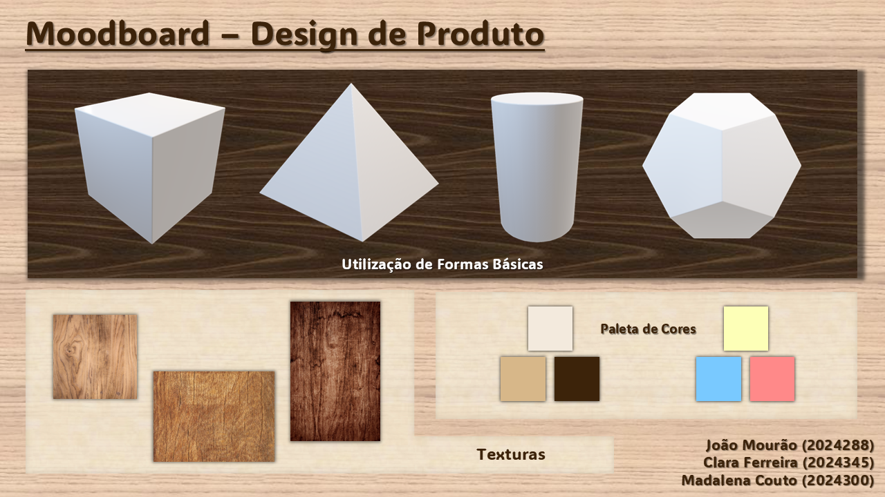

# Contexto de Design

Página explicativa do contexto, em concordância com a apresentação produzida em grupo. Componente de **grupo**.

## Resumo / Abstract

### Resumo (PT)
O tema principal do nosso projeto surge do nosso gosto coletivo de criar e experienciar histórias. Com essa inspiração em mente, visámos desenvolver brinquedos que tivessem como objetivo inspirar crianças a criar as suas próprias histórias e narrativas, através do ato de brincar. A ideia é que tivessem à sua disposição personagens e cenários para as guiar nesse processo e assim desenvolver essa habilidade criativa.
### Abstract (EN)
The main theme of our project stems from our collective love of creating and experimenting with stories. With this inspiration in mind, we aimed to develop toys that inspire children to create their own stories and narratives through play. The idea is that they would have characters and settings available to guide them in this process, thus developing this creative skill.

## Moodboard

