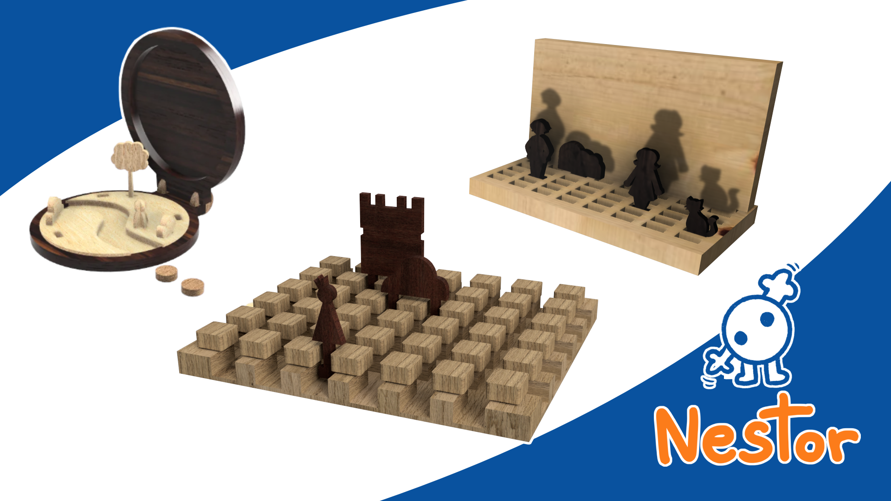
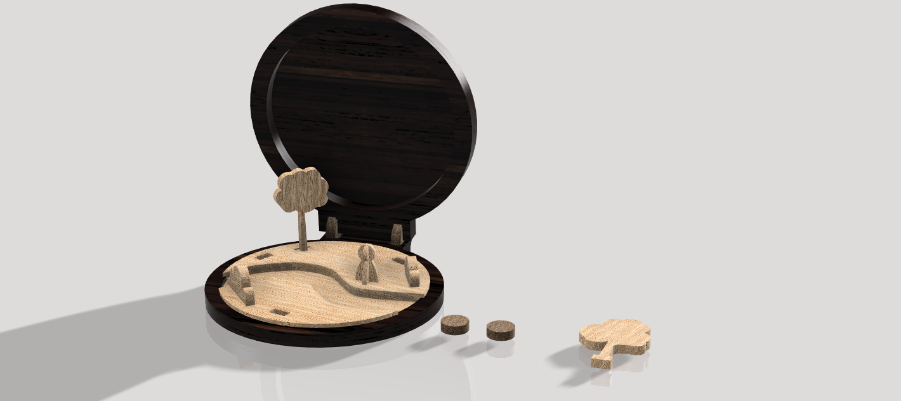
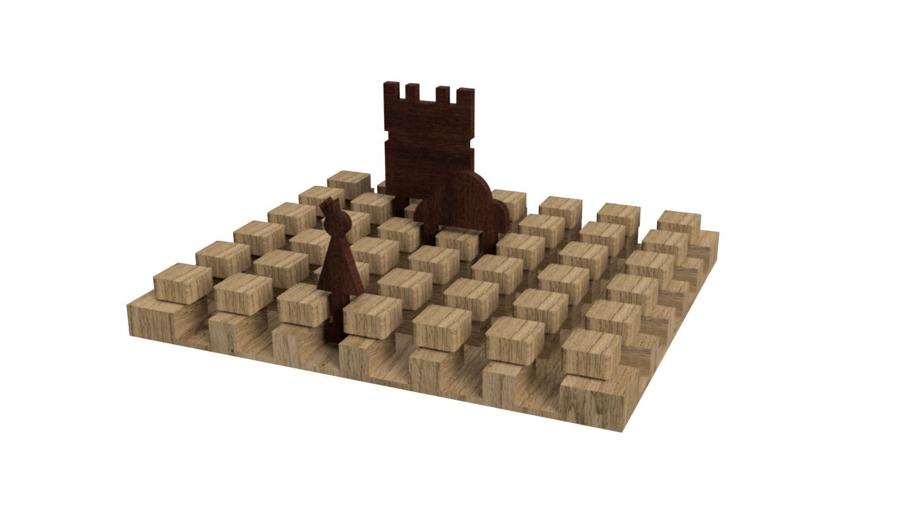

# Contador de Histórias

> Com os nossos brinquedos, as crianças desenvolvem a sua imaginação e criatividade através da criação de histórias.

## Elementos do Grupo

| Número  | Nome           |
| ------- | -------------- |
| 2024345 | Clara Ferreira |
| 2024331 | Henrique Vera  |
| 2024288 | João Mourão    |
| 2024300 | Madalena Couto |

---

## Contexto de Design

> A temática principal dos nossos projetos foi a criação de histórias através da brincadeira e interação com brinquedos. Para esse efeito, desenvolvemos projetos que puxam pela criatividade das crianças e as desafiam a criar narrativas.

[Ver contexto completo →](contexto.md)

---

## Galeria de Produtos

  <!-- duplicar o bloco abaixo para cada produto do grupo -->

  <a class="gallery-card" href="produtos/_madalena/">
    
    <h3>Livro de Histórias</h3>
    
Madalena Couto

  </a>

  <a class="gallery-card" href="produtos/_joao/">
    
    <h3>Cenário em Grelha</h3>
    
João Mourão

  </a>

  <a class="gallery-card" href="produtos/_clara/">
    
    <h3>Jogo de Sombras</h3>
    
Clara Ferreira

  </a>
  <!-- duplicar o bloco acima para cada produto do grupo  e substituir _modelo em ambas por <numero>-<nome> -->

<!-- markdownlint-enable MD033 -->
