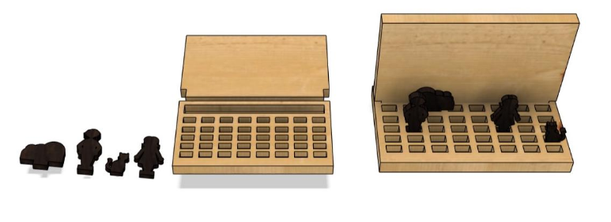
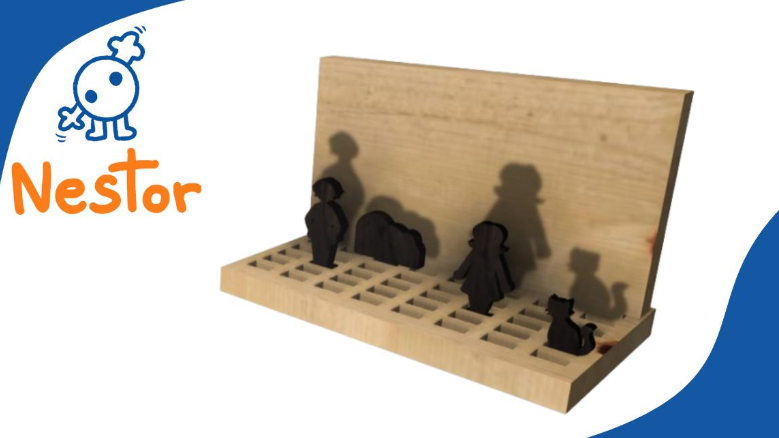
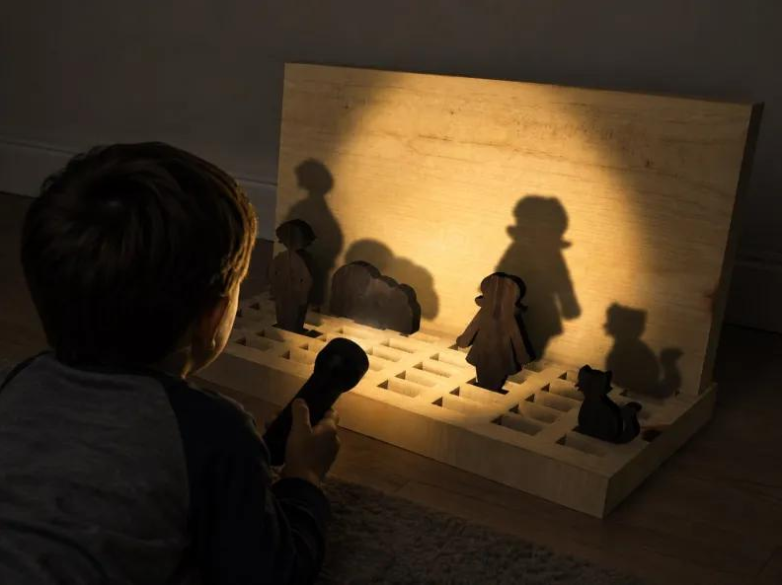

# Jogo de Sombras

## Conceito

A ideia central do brinquedo é para crianças poderem brincar com os objectos e fazerem jogos com as sombras e poderem imaginar e criar novos cenas com a sua imaginação.
## Enquadramento
Seguindo o nosso tema coletivo de brinquedos focados na criação de histórias e imaginação das crianças, decidimo-nos focar com este produto na criação dos cenários dessas mesmas histórias, permitindo ao utilizador imaginar os seus próprios cenários através das peças disponíveis.
O brinquedo em si comporta-se como um cenário de sombras, deixando a criança movimentar e imaginar o que quiser, como quiser.
A inspiração principal são os teatros de sombras de fantoches, usados para contar histórias de uma maneira única.
## Tecnologia
#### Madeira:
- Madeira de Pinho;
- Madeira de Nogueira.

#### Processo de Fabrico:
Para a sua fabricação optamos pelo corte de madeira de uma fresa CNC.
Como são cortes relativamente simples, não é preciso ajustar muitas coisas após o corte.

#### Modelo 3D:
[Modelo 3D](https://a360.co/44cC96K "https://a360.co/44cC96K")
Ficheiros: `attachments/`

## Função
#### Como se brinca:
- Encaixar a placa na vertical para dar a ideia de cenário, e os brinquedos também encaixando da maneira que o utilizador queira;
- Depois com uma fonte de luz, projeta as sombras para a placa vertical.
#### Publico alvo:
**Crianças (4-10 anos):** Consideramos um grupo etário de crianças mais novas pois as peças podem ser pequenas de mais para infantes.
#### Conformidade com a Diretiva 2009/48/CE:
O brinquedo foi concebido de acordo com os princípios da Diretiva 2009/48/CE, apresentando uma estrutura robusta e estável em madeira, com superfícies lisas e arestas suavizadas que reduzem o risco de lesões durante a utilização. As peças possuem dimensões adequadas para o manuseamento pelas crianças e o design simples minimiza a existência de perigos mecânicos.

## Apresentação

---

## Processo
[Ver processo completo →](produtos/_madalena/processo.md)
