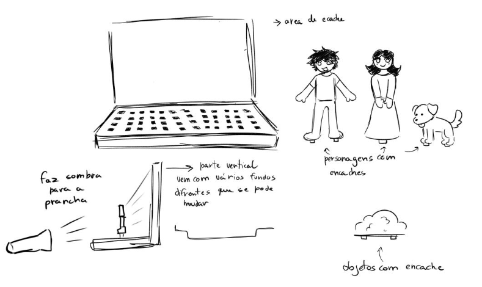

# Jogo de Sombras

## Conceito
A ideia principal do brinquedo é para crianças poderem brincar com os objectos e
fazerem jogos com as sombras e poderem imaginar e criar novos cenas com a sua
imaginação.

## Enquadramento

Posicionamento em relação ao contexto de grupo (ver [contexto](../../contexto.md)) e à recolha de objetos a redesenhar.

## Tecnologia

#### Madeira:
- Madeira de Pinho;
- Madeira de Nogueira.

- Modelo 3D: <!-- embed Fusion ou link a360.co -->
- Ficheiros: `attachments/`

## Função
- Encaixar a placa na vertical para dar a ideia de cenário, e os brinquedos também
encaixando da maneira que o utilizador queira;
- Depois com uma fonte de luz, projeta as sombras para a placa vertical.

## Apresentação

Imagens-chave que sintetizam o produto final.

---

## Processo

O percurso completo de iterações, modelos e pesquisa está em [processo.md](produtos/_madalena/processo.md), organizado do **mais recente** para o **mais antigo**.

[Ver processo completo →](produtos/_madalena/processo.md)
