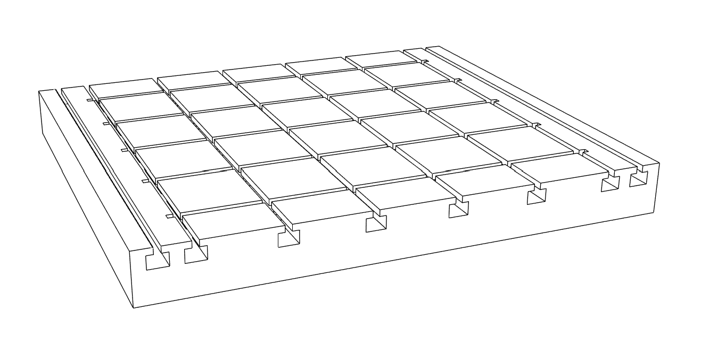
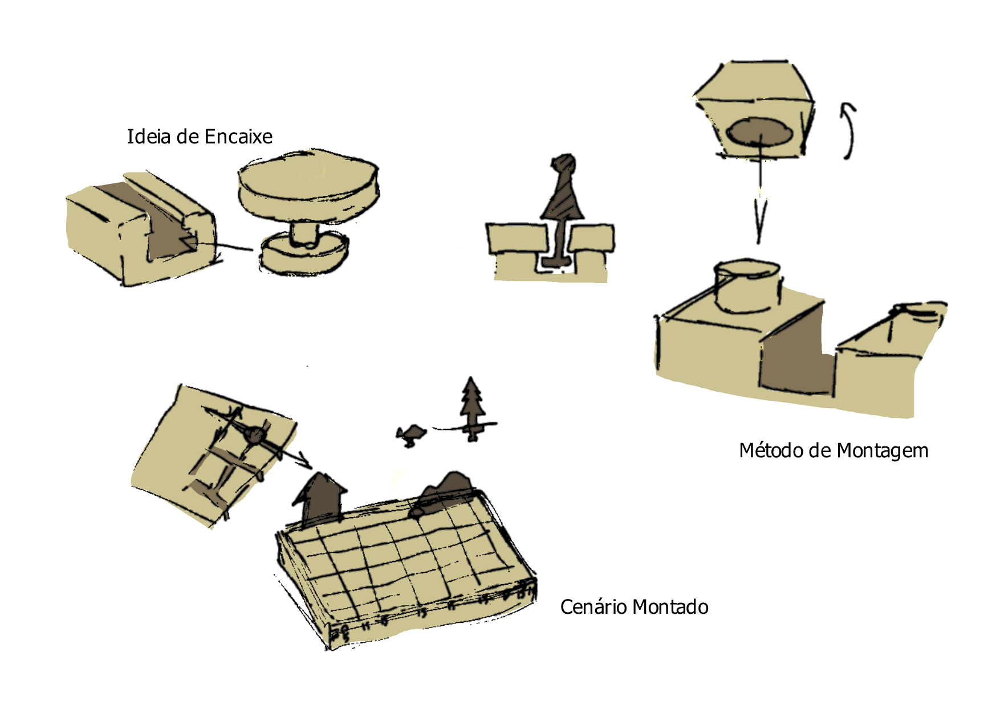

# Processo

## Modelo 3D Final

[Modelo 3D](https://a360.co/4uAXZwf) 

## Modelos Anteriores

O processo de obter o modelo final passou por várias iterações. O maior desafio foi tentar executar a minha ideia de encaixe de uma maneira que fosse viável de produzir na fresa CNC. Abaixo estão alguns dos modelos anteriores.
[Modelo1](https://a360.co/4vI8y0I)

>Primeiro modelo experimental, feito para testar a viabilidade do tipo de encaixe.
## Esboços e Pranchas-Resumo

>Prancha-Resumo com Esboços
## Pesquisa

### Aspectos Valorizados do Moodboard:

Baseando-me no moodboard do grupo, tentei criar um brinquedo que se baseasse num sólido geométrico básico, utilizando madeiras de diferentes tons para criar contraste visual.