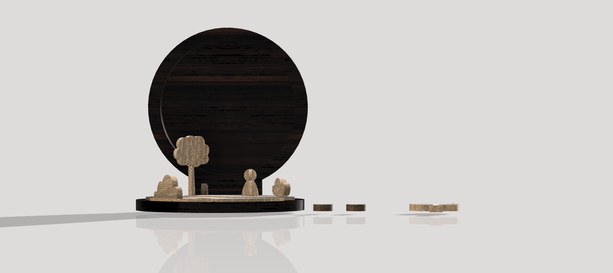
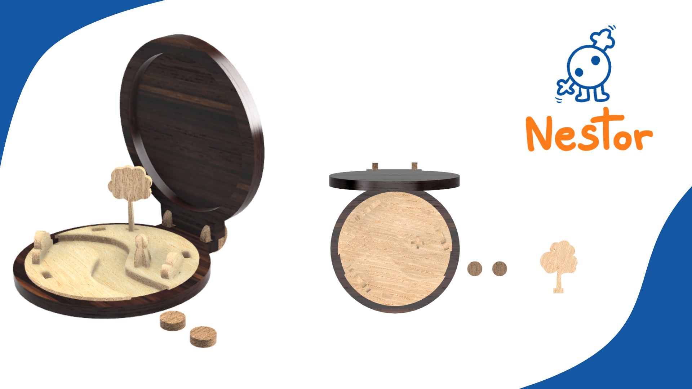
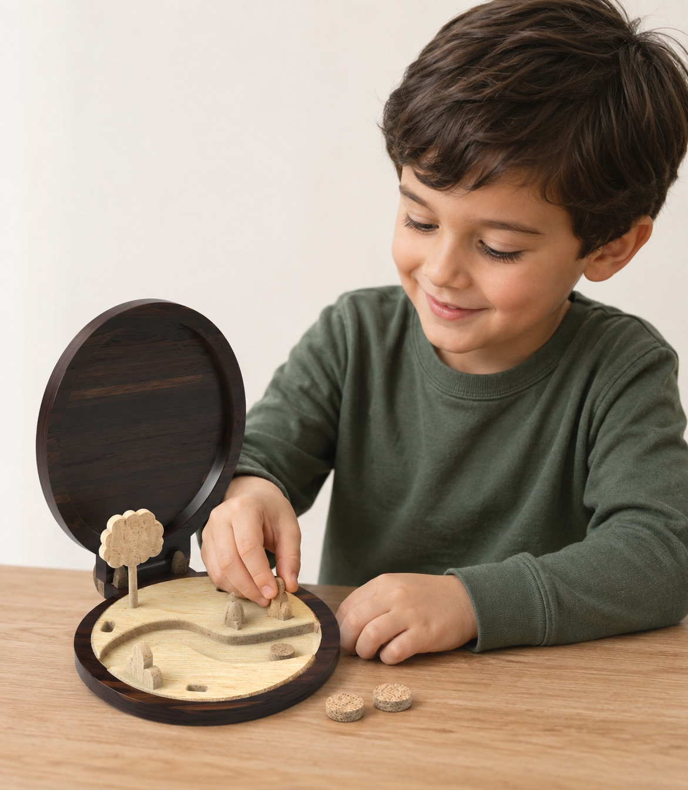

# Livro de Histórias
>Um livro com várias peças que pode criar um cenário de uma história.

## Conceito
Criação de uma história em um livro. Este livro cria a liberdade de o utilizador criar a sua história como se estivesse a sair do próprio livre em que a história existe.

## Enquadramento

Para a continuação do tema de criar histórias, este brinquedo tem uma forma mais literal, tem a forma de um livro simples, que quando aberto tem um cenário em que o utilizador pode montar como quiser com as peças ao seu dispor.
O brinquedo tem uma forma simples, igual a um livro de crianças, mas quando aberto apresenta um cenário men que o utilizador pode mudar como quiser, dando a liberdade de criar uma história como se estivesse a sair de um livro.
A maior inspiração para este brinquedo foi os “livros pop-up” mas adaptando essa ideia em una estrutura mais 3D com a necessidade de se montar cada cenário mas existindo a liberdade de a modificar como cada utilizador assim deseje.

## Tecnologia

**Materiais:** Madeira de Pinho e Nogueira
**Processo de Fabrico:** CNC

**Modelo 3D:**
[Modelo 3D](https://a360.co/44gPwCU "https://a360.co/44gPwCU")
Ficheiros: `attachments/TEATRO 2.f3d`

## Função
#### Como se brinca:
O livro é aberto e apresenta um cenário em que utilizador pode mover livremente as peças e monta-lo ao longo da história, tendo liberdade de tirar e montar qualquer peça. 

#### Público alvo:
**4-9 anos** - O livro tem uma fácil intuição, no entanto requer uma uma criança mais velha para o manuseamento das peças mais pequenas.

#### Conformidade com a Diretiva 2009/48/CE:
O brinquedo foi concebido de acordo com os princípios da Diretiva 2009/48/CE, apresentando uma estrutura estável, superfícies lisas e arestas arredondadas que minimizam o risco de lesões. A sua construção em madeira e a ausência de elementos perigosos, como pontas cortantes ou componentes elétricos, contribuem para a segurança da criança durante a utilização.

## Apresentação

---

## Processo
[Ver processo completo →](produtos/_madalena/processo.md)
