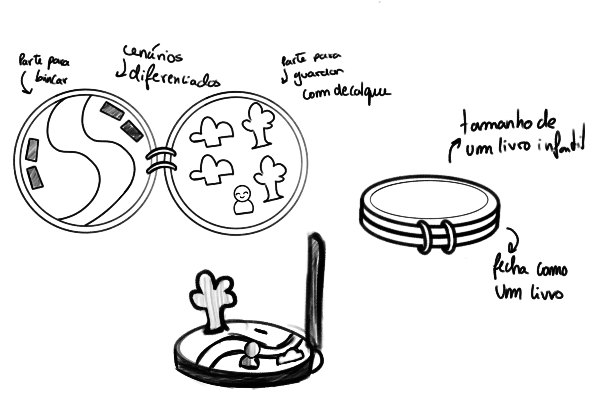
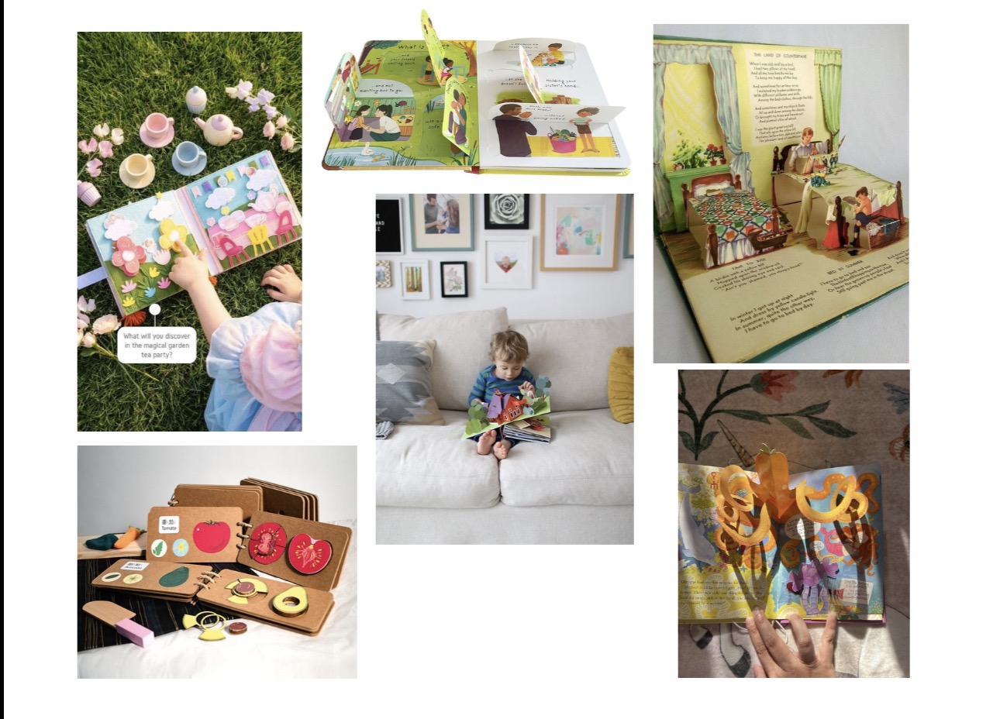

# Processo

## Modelo 3D:
[Modelo 3D](https://a360.co/44gPwCU "https://a360.co/44gPwCU")

## Prancha-Resumo:

## Pesquisa
### Aspectos valorizados do moodboard:

Baseando-me no moodboard do grupo, tentei criar um brinquedo que se baseasse num sólido geométrico básico, utilizando madeiras de diferentes tons para criar contraste visual.
### Referências:
